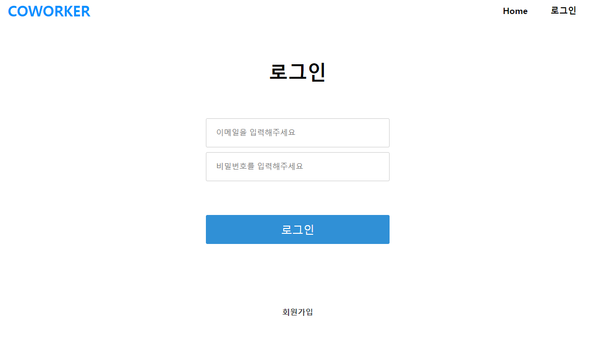
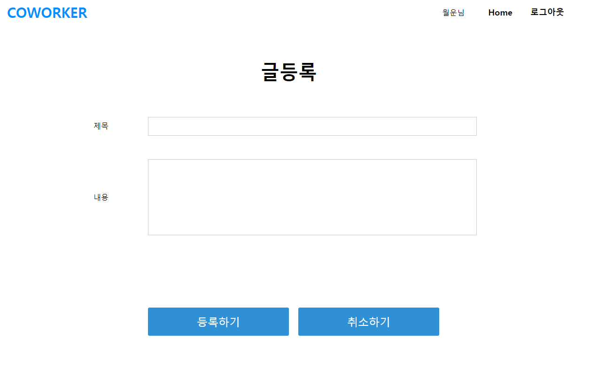
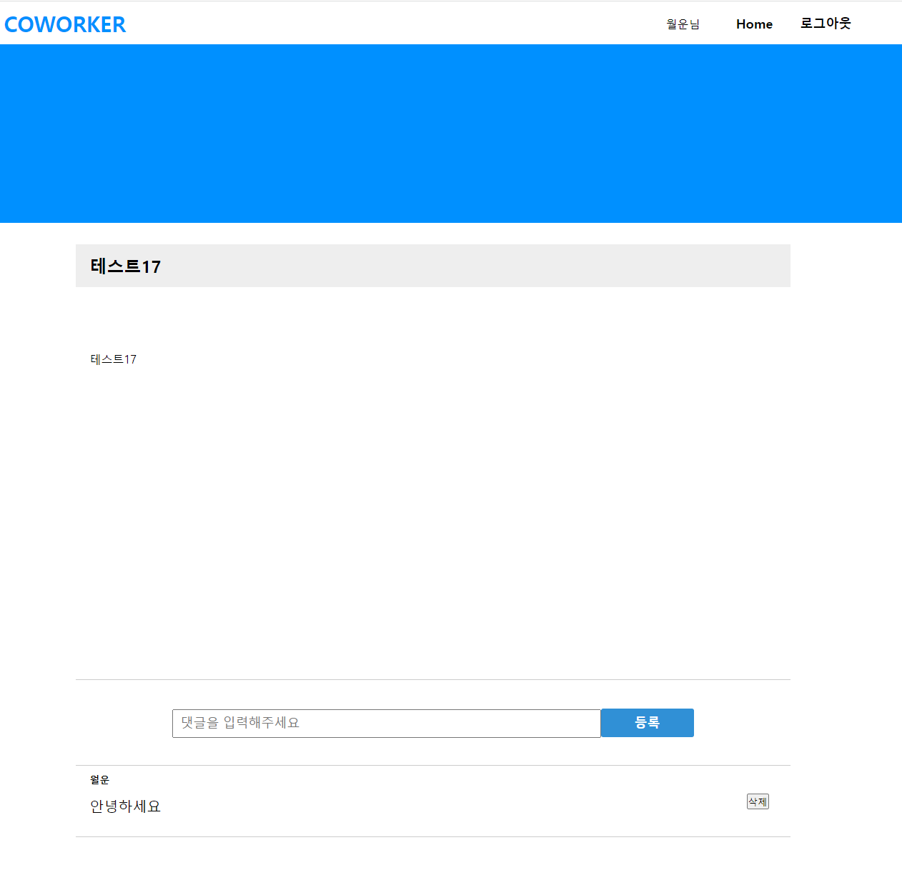
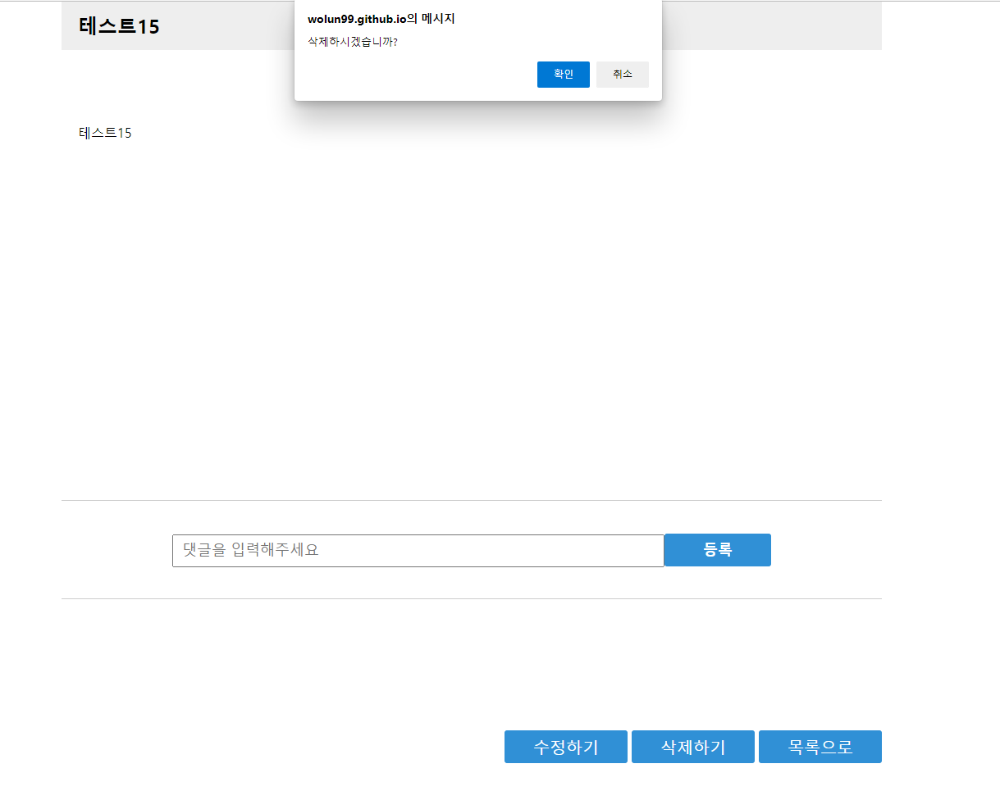

# cowork
프로젝트나 필요한 인원을 구할 수 있는 사이트

## 개요
혼자 프로젝트를 하거나 다른 기술을 가지고 있는 사람이 필요하면 사용할 수 있는 커뮤니티를 만들면 어떨까? 라는 생각을 시작으로 cowork라는 이름의 사이트를 제작하게 되었습니다.

백엔드는 Firebase를 기반으로 하였고 프론트는 Vue.js를 사용하여 구현하였습니다.

## 시작하기

- 레포지토리를 Clone하여 작업물을 가져옵니다.
  ```js
    git clone https://github.com/wolun99/coworker.git
  ```
- 클론을 한 이후 라이브러리등을 설치하기 위해 install을 합니다.
  ```js
    npm install
  ```
- 프로젝트를 실행
  ```js
    npm run serve
  ```

## 기술스택

- Vue
- Vuex
- Vue-router
- Firebase


## 기능
### **1. 로그인/회원가입**
- firebase의 이메일 등록을 이용하여 회원가입을 구현하였고 로그인을 구현하였습니다.

    <br/><br/>

### **2. 글작성/수정**
- 글등록을 할 때 Id를 같이 값으로 전달하여 작성자 확인을 하여 작성자만 수정하도록 작업했습니다.

    <br/><br/>

### **3. 댓글 작성/제거**
- 댓글을 작성자가 삭제 할 수 있도록 작업했습니다.

    <br/><br/>

### **4. 글삭제**
- 글의 작성자만 삭제 가능하도록 작업하였습니다.

    <br/><br/>

## 프로젝트하면서 어려웠던 점
1. Firebase 자체가 처음이여서 검색을 통해 사용법을 찾아 적용하려 했지만 web8버전이 많아 사용법이 많이 달랐습니다.
    - 공식문서를 통해 객체의 형태로 바뀐것을 확인하였고 바뀐 객체들을 사용법에 맞게 작업하였습니다.<br/><br/>

2. 댓글 등록을 할 때 firebase에서 만들어둔 update함수를 사용하였는데 http 메서드인 put과 같이 전부 바뀌는 형태여서 전에 등록한 정보가 모두 사라지는 현상이 발생했습니다.
    - update함수를 통해 넘겨주는 데이터는 {comment:[]} 형태로 전달하여 배열의 메서드중 하나인 push를 사용하여 배열의 마지막에 추가하였고 삭제 기능은 splice 메서드를 활용하여 자신의 인덱스 값을 뽑아낸뒤 제거하는 방식으로 해결하였습니다.
